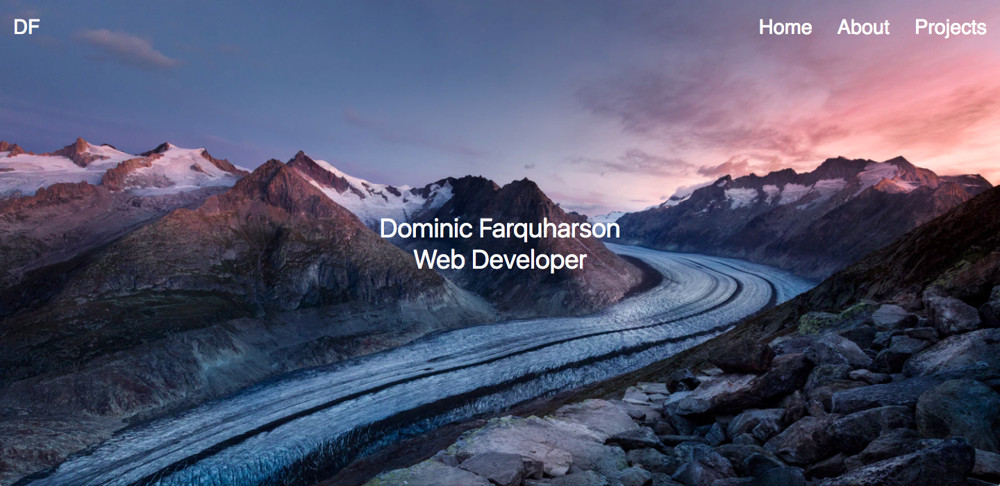

#Portfolio

This is my personal portfolio website. The website was meant to provide some insight into my background and to showcase my projects.

[Link to site]()

#### Landing Page


#### Projects Section


---
##Technologies Used:

- HTML
- SaSS
- React.js
- jquery
- UI Kit
- Firebase
- axios

---
##Installation Instructions

- Download folder.
- Run npm install in terminal.
- Run npm start from terminal.

---
##Sample Code: Printing Projects and Skills
```javascript

// ajax call to firebase - setting state
fetchSkillsAndProjects() {
  // firebase endpoint
  const url = 'https://portfolio-5e471.firebaseio.com/.json';
  // get request to firebase endpoint - read permission only
  axios.get(url)
    .then( (response) => {
      // Running setState method for skills and projects
      this.setState({
        skills: response.data.skills,
        projects:response.data.projects
      })
    })
    .catch( (error) => {
      console.log(error)
    })

}
```
---
##Build Strategy
```
React.js:

  1. Create UI by using JSX.
  2. Fetch Skills and Projects from Firebase endpoint.
  3. Create JSON file containing relevant data.
  4. Upload that JSON file to firebase.

JavaScript/jQuery/axios:
  1. Incorporate into React.
  2. Perform a GET request to firebase database using axios.

Styling:
  1. Use UI Kit to simplify positioning, etc.
  2. Use Sass to allow for easy CSS styling through the use of mixins, etc.

```  

##Future Goals:
- Styling! Styling! Styling!
- Maybe pull from an inspirational quote API and add that to landing page.
- Possibly make a fixed header when user scrolls down.


##Author

Dominic Farquharson
